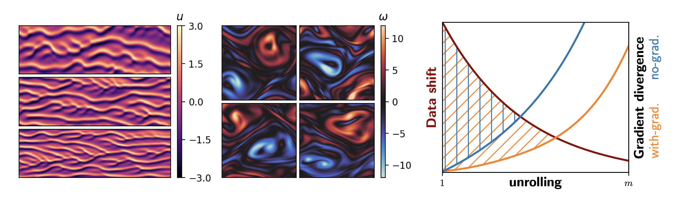

# Docs

This repository follows our paper 
_Differentiability in Unrolled Training of Neural Physics Simulators on Transient Dynamics_, published in
*Computer Methods in Applied Mechanics and Engineering*.
- [CMAME version](https://authors.elsevier.com/sd/article/S0045-7825(24)00696-0)
- [arXiv preprint](https://arxiv.org/pdf/2402.12971) 

We study different unrolling strategies. This includes differentiable (WIG) and non-differentiable (NOG) unrolling variants which we compare to a baseline one-step approach (ONE). These comparisons can be replicated with the provided code. Training data can either be generated with the scripts from this repository or downloaded ([coming soon](??)).

---

## TL;DR
-	Unrolling with non-differentiable numerical solvers improves inference accuracy
-	Non-differentiable unrolling can be achieved without re-implementing existing codes 
-	Combinations of numerics and ML outperform purely learning based simulators
-	Neural network architectures converge slowly with respect to the parameterization


---


## Abstract


Unrolling training trajectories over time strongly influences the inference accuracy of neural network-augmented physics simulators. We analyze these effects by studying three variants of training neural networks on discrete ground truth trajectories. In addition to commonly used one-step setups and fully differentiable unrolling, we include a third, less widely used variant: unrolling without temporal gradients. Comparing networks trained with these three modalities makes it possible to disentangle the two dominant effects of unrolling, training distribution shift and long-term gradients. We present a detailed study across physical systems, network sizes, network architectures, training setups, and test scenarios. It also encompasses two modes of computing the simulation trajectories. In prediction setups, we rely solely on neural networks to compute a trajectory. In contrast, correction setups include a numerical solver that is supported by a neural network. Spanning all these variations, our study provides the empirical basis for our main findings: A non-differentiable but unrolled training setup supported by a numerical solver in a correction setup can yield substantial improvements over a fully differentiable prediction setup not utilizing this solver. We also quantify a difference in the accuracy of models trained in a fully differentiable setup compared to their non-differentiable counterparts. Differentiable setups perform best in a direct comparison of correction networks, and the same is observed when comparing prediction setups among each other. In both cases, the accuracy of unrolling without temporal gradients comes relatively close. Furthermore, we empirically show that these behaviors are invariant to changes in the underlying physical system, the network architecture and size, and the numerical scheme. These results motivate integrating non-differentiable numerical simulators into training setups even if full differentiability is unavailable. We also observe that the convergence rate of common neural architectures is low compared to numerical algorithms. This encourages the use of correction approaches combining neural and numerical algorithms to utilize the benefits of both.

---

## Kuramoto-Sivashinsky


### Requirements
A `requirements.txt` file is provided. If torch-geometric is not installed, the CNNs can still be trained by setting 
```
export KS_DISABLE_GCN=1 
```

### Training a single set ot networks 

A single set of networks (ONE/NOG/WIG) can be trained with the `ks_train.py` script. The following arguments can be supplied:

- `--do-gendata`: Generate data for this run. Set to  `1|0`. We recommend generating data once for all runs or using our dataset available as a download. 

- `--do_train`: Train a network within this run. Set to  `1|0`. 

- `--do_eval`: Evaluate trained network directly. Set to  `1|0`. 

- `--train-onestep`: Train a **one-step** network within this run. Set to  `1|0`. 

- `--train-nog`: Train a **non-differentiable (no-gradient/NOG)** network within this run. Set to  `1|0`. 

- `--train-wig`: Train a **differentiable (with-gradient/WIG)** network within this run. Set to  `1|0`. 

- `--predhori`: Prediction horizon used in the unrolling in number of time-steps. Our test use 3 steps.

- `--learning-task`: Differentiate between `predict|correct|corr-pred-transition`. **Prediction** trains a neural network as surrogate to calculate the solution at the next timestep. The network can then be unrolled to predict entire trajectories. **Correction** networks use an additional low order numerical solver and a neural network to achieve the same task. They can be seen as a closure model in the scientific computing context. The option **corr-pred-transition** trains a range of networks with varying accuracy of the additional solver, also resulting in a varying difficulty of the learning task.

- `--warmup_steps`: Uses initial steps in an unrolling that do not contribute to the loss. Identical to the "pushforward trick". 

- `--detach_interval`: Cuts gradients into subsections, similar to backpropagation trunctation. This parameter specifies the interval size between cuts. An interval then contains steps through which gradients can be backpropagated. Setting to `0` means no cuts are made.

- `--seed`: Random seed for initialization.

- `--epochs`: Number of training epochs, is increased when the dataset fraction is reduced.

- `--timestep`: Timestep size, in our datasets and tests this is set to `0.5` which is also the default.

- `--network-type`: Choose between convolutional or graph networks `CNN|GCN`.

- `--channels`: Number of channels in the network.

- `--depth`: Depth of the network in number of ResNet blocks (i.e. two layers per block).

- `--batch-size`: Batch size for training.

Further options are shown when running ```python ks_train.py --help```.

Here is an example for an easy-to-run training call:
```
python ks_train.py --channels 26 --depth 8 --outstart 100 --dataset_fraction 0.1  --train_nog 1  --network_type CNN --learning_task correct --seed 100  --compile 0
```


### Evaluation

- `--horizon`: Evaluation horizon in number of time steps to simulate. For relative errors we used 12 steps.

- `--numtests`: Number of test scenarios to run per model and domain size.

- `--metric`: Choose metric to evaluate with from `rellinf|l2|correlation|divtime|divergence-time-simple`: "rellinf" computes a relative LInf metric, "l2" computes an L-2 loss wrt ground truth for full length; "correlation" computes time until cross correlation drops below decorr_thresh; "divtime" performs stability check, ie measures time until divergence (error above --thresh) and labels sim results as Static, Unstable, Recurring or Regular; "divergence-time-simple" is same as divtime without classification.

- `--thresh`: Loss threshold for the divergence time metric (default 500).

- `--decorr_thresh`: Threshold for the decorrelation metric (default 0.2). 

- `--timestep`: Timestep size, in our datasets and tests this is set to `0.5` which is also the default.

- `--run_eval`: `1|0`, `1` runs new evaluation simulations, `0` loads existing data

- `--agg_mode`: `0|1|2|3` Aggregation mode for loss values, default is 0 (mean), alternatives max (1) or min (2 or -1), or mean relative-to-ONE mode (3)

Further options are shown when running ```python ks_eval.py --help```.

Here is an example for an evaluation call:
```
python ks_eval.py --numtests 10 --horizon 12 --outstart 107 --outend 109 --metric rellinf
```

---
## Kolmogorov Flow
The numerical backend of the Kolmogorov flow experiments is based on the differentiable piso implementation published [here](https://doi.org/10.1017/jfm.2022.738).

### Installation instructions
Required packages/software:

- CUDA 10.0

Pip:
- python=3.6
- numpy>=1.17
- matplotlib>=3.3.4
- scipy>=1.5.2
- tensorflow_gpu==1.14

The CUDA custom operations (PISO and PhiFlow) can be compiled from source by calling
```python setup.py tf_cuda```.
This requires installations of CUDA's ```nvcc``` compiler and ```gcc4.8```. For convenience, we also provide the compiled binaries in this repository.

### Training runs
To run the correction experiments for the KOLM testcase, execute the `kolm_train.py` script. Arguments are parsed with the `argparse` library. The following arguments are supported:

- `--gradient` and `--nogradient` for WIG and NOG runs respectively
- `--seeds`: one or more random seeds, trains indepenent networks with these initializations iteratively 
- `--feat_selector`: integer specifying which network size out of the four predefined to use
- `--batch_size`: batch sized used during training
- `--step_counts`: one or more integers defining the curriculum of unrolled steps, e.g. `1 2 4` starts training with 1 step and then proceeds with 2 and 4 
- `--start_learning_rate`: one or more floats defining the learning rates to be used in the curriculum
- `--epochs`: number of epochs used per curriculum step
- `--directory_name`: name of sub-directory in which the run is stored

### Inference runs

Multiple models can be processed by adding the desired model checkpoints to the list in `correction_inference.py`. The script automatically runs the inference setup on the interpolative and extrapolative testcases (i.e. Re=600, Re=1000) for each model in the list. The trajectories are stored the trajectories in the respective directories.

### Model evalutaion

The `kolm_evalutaion.ipynb` notebook runs the evaluation and generates plots for a list of trajectories. The test loss is calculated with respect to a series of interpolative and extrapolative reference trajectories. 
